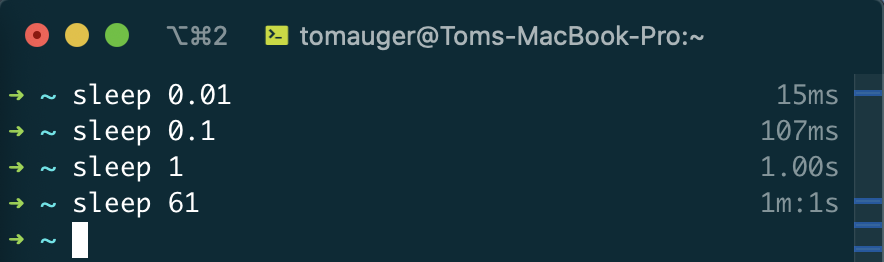

# cmdtime
ZSH plugin to display the duration of a command to the terminal forked from the [timer](https://github.com/ohmyzsh/ohmyzsh/tree/master/plugins/timer) plugin.



## Installation

To install clone this repo into `~/.oh-my-zsh/custom/plugins/`:

```
$ cd ~/.oh-my-zsh/custom/plugins
$ git clone https://github.com/tom-auger/cmdtime
```

Then edit `~/.zshrc` and add to the list of plugins:

```
plugins=(cmdtime other_plugins)
```

Reload your ZSH config to apply:

```
$ source ~/.zshrc
```